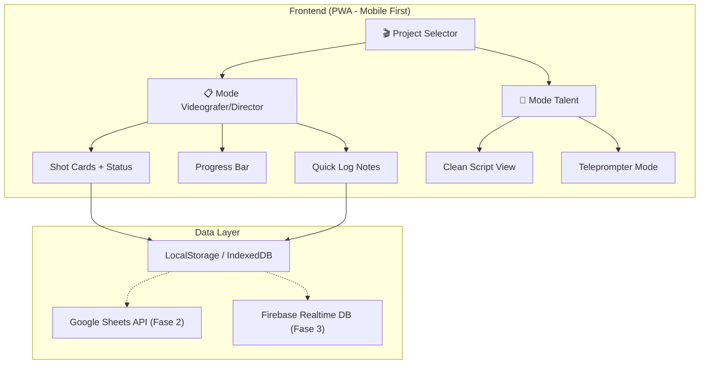

# On-Set Creative Assistant — Implementation Plan

Membangun aplikasi web internal mobile-first untuk memudahkan tim produksi video (Director, Videografer, Talent) mengelola shot list, naskah, dan progress shooting secara real-time langsung dari lokasi syuting — menggantikan kertas kerja fisik / Google Docs.

---

## Open Questions

> [!IMPORTANT]
> **Pertanyaan berikut perlu dijawab sebelum mulai development:**

### 1. Integrasi Google Sheets
Spesifikasi menyebutkan Google Sheets sebagai basis data real-time. Ada beberapa pendekatan:

| Pendekatan | Kelebihan | Kekurangan |
|---|---|---|
| **A) Google Sheets API langsung dari browser** | Simpel, tanpa server | Perlu OAuth consent per user, rate limit ketat |
| **B) Backend server (Node.js) sebagai proxy ke Google Sheets** | Aman, bisa caching, satu service account | Perlu hosting server |
| **C) Mulai dengan Local Storage / IndexedDB dulu, integrasi Sheets belakangan** | Bisa langsung pakai tanpa setup API | Data belum sync ke Sheets |

**Rekomendasi**: Opsi **C** untuk fase pertama — kita bangun UI & logika dulu dengan data lokal, lalu tambahkan integrasi Google Sheets di fase berikutnya. Ini memungkinkan kalian langsung pakai di lapangan tanpa perlu setup API dulu.

### 2. Real-time Sync (Modul Talent Auto-Sync)
Fitur auto-sync scene di perangkat Talent mengikuti pilihan Director membutuhkan mekanisme komunikasi real-time antar perangkat:

| Opsi | Kompleksitas |
|---|---|
| **A) BroadcastChannel API (satu device/browser)** | Sangat mudah, tapi hanya satu device |
| **B) Polling ke Google Sheets setiap beberapa detik** | Mudah, tapi delay & boros kuota API |
| **C) WebSocket server sederhana** | Real-time, tapi perlu server |
| **D) Firebase Realtime Database** | Real-time, gratis tier, tanpa server | 

**Rekomendasi**: Opsi **A** untuk satu device (toggle antara mode), dan opsi **D** (Firebase) untuk multi-device sync di fase lanjutan.

### 3. Struktur Data Google Sheet
Bagaimana struktur Google Sheet yang sedang digunakan saat ini? Apakah seperti ini?

```
| Scene | Shot ID | Action/Brief | Shot Type | Equipment | Script/Dialog | Status | Notes |
|-------|---------|-------------|-----------|-----------|---------------|--------|-------|
| 1     | S1-01   | Talent masuk ke bar | Wide Shot | Gimbal | "come make your coffee..." | PENDING | - |
```

Atau ada format lain? Ini penting untuk mapping data.

### 4. Input Data / Manajemen Proyek
Bagaimana data shot list dimasukkan ke sistem?
- **A)** Manual input via form di web app (buat proyek baru langsung dari app)
- **B)** Import dari Google Sheets yang sudah ada
- **C)** Keduanya

### 5. Multi-Proyek
Apakah app ini perlu mendukung banyak proyek sekaligus (misal: Project W, Grillme, dll) dengan kemampuan switch antar proyek? Atau cukup satu proyek aktif pada satu waktu?

### 6. Autentikasi
Apakah perlu sistem login, atau cukup buka di browser langsung pakai? (Mengingat ini internal tool)

---

## User Review Required

> [!WARNING]
> **Keputusan desain berikut akan mempengaruhi arsitektur:**

1. **Framework Frontend**: Saya merekomendasikan **Vite + React** karena kompleksitas UI (dua mode view, state management, dynamic cards). Alternatif: Vanilla JS + HTML (lebih ringan tapi lebih sulit maintain).

2. **PWA (Progressive Web App)**: Saya sarankan membuat ini sebagai PWA agar bisa di-"install" di home screen HP dan bekerja offline (data tersimpan lokal). Cocok untuk di lapangan yang mungkin sinyal internet terbatas.

3. **Fase Development**: Saya sarankan pendekatan bertahap:
   - **Fase 1**: UI + logika lokal (data di browser) — sudah bisa dipakai di lapangan
   - **Fase 2**: Integrasi Google Sheets
   - **Fase 3**: Real-time sync multi-device

---

## Proposed Changes

### Arsitektur Sistem



---

### Fase 1: Core App (MVP — Bisa langsung pakai di lapangan)

#### [NEW] Project Setup — Vite + React
- Inisialisasi project dengan Vite + React
- Setup PWA manifest & service worker
- Dark mode sebagai default theme

#### [NEW] `src/components/ProjectManager/`
- **ProjectSelector**: Halaman awal untuk memilih/membuat proyek
- **ProjectForm**: Form input metadata proyek (Nama, Klien, Tanggal, Deadline, Target Audience, Konsep)
- Data tersimpan di `localStorage` / `IndexedDB`

#### [NEW] `src/components/ShotCard/`
- **ShotCard**: Kartu individual per shot dengan informasi:
  - Scene number & Shot ID
  - Status badge (🟡 PENDING → 🟢 DONE → 🔴 REVISI)
  - Shot type & angle (Close Up, Wide, Top Down, dll)
  - Equipment list (chips/tags)
  - Brief action description
  - Script/dialog text
  - Referensi image (tap to zoom fullscreen)
  - Quick link ke referensi eksternal
  - Tombol "TAKE DONE" (mengubah status)
  - Quick log input field
  
#### [NEW] `src/components/ProgressBar/`
- **ProductionProgress**: Bar progress sticky di atas layar
- Menampilkan: `6 dari 12 Shot Selesai — 50%`
- Warna gradient berubah sesuai progress

#### [NEW] `src/components/Navigation/`
- **SceneFilter**: Filter/navigasi cepat berdasarkan Scene
- **StatusFilter**: Filter berdasarkan status (PENDING / DONE / REVISI)
- **ModeToggle**: Switch antara Mode Tech ↔ Mode Talent

#### [NEW] `src/components/TalentView/`
- **ScriptView**: Tampilan naskah bersih tanpa info teknis
- Typography besar (18-22px) untuk jarak baca 0.5-1m
- Highlight ekspresi/instruksi aksi dengan warna kontras
- Contoh: `<EKSPRESI KAGET>` ditampilkan dengan badge kuning
- Auto-scroll mengikuti shot aktif

#### [NEW] `src/components/ImageViewer/`
- **FullscreenViewer**: Tap to zoom referensi foto
- Pinch-to-zoom support
- Overlay di atas konten

#### [NEW] `src/hooks/`
- **useProject**: Hook untuk CRUD data proyek
- **useShots**: Hook untuk manage shot list & status
- **useLocalStorage**: Wrapper untuk persistent storage

#### [NEW] `src/data/sampleData.js`
- Data contoh berdasarkan kertas kerja "Project W" yang dikirimkan
- Digunakan untuk demo dan development

---

### Desain UI/UX Detail

#### Color Palette (Dark Mode)
```
Background:       #0A0A0F (deep dark)
Surface:          #12121A (card background)  
Surface Elevated: #1A1A2E (modal/overlay)
Primary:          #6C63FF (electric purple — accent utama)
Success:          #00E676 (shot done)
Warning:          #FFD740 (revision needed)
Pending:          #78909C (belum diambil)
Text Primary:     #E8E8F0
Text Secondary:   #8888A0
Talent Highlight: #FF6B6B (instruksi ekspresi)
```

#### Komponen Visual Kunci

| Komponen | Deskripsi |
|---|---|
| **Shot Card** | Glassmorphism card dengan border gradient subtle, status badge di pojok kanan atas |
| **Take Done Button** | Tombol besar hijau neon dengan haptic-like animation saat diklik |
| **Progress Bar** | Gradient bar (purple → green) dengan animasi smooth saat update |
| **Mode Toggle** | Pill-style toggle dengan slide animation (🎬 Tech ↔ 📝 Talent) |
| **Script Expression Tags** | Badge berwarna dengan icon emoji untuk instruksi aksi talent |

---

### Fase 2: Google Sheets Integration (Setelah Fase 1 selesai & stabil)

#### [NEW] `src/services/sheetsAPI.js`
- Koneksi ke Google Sheets API v4
- CRUD operations (read shot list, update status, write notes)
- Sync bi-directional antara local storage dan Sheets

#### [MODIFY] `src/hooks/useShots.js`
- Tambahkan layer sync ke Google Sheets
- Fallback ke local storage saat offline

---

### Fase 3: Real-time Multi-Device Sync (Opsional)

#### [NEW] `src/services/realtimeSync.js`
- Firebase Realtime Database integration
- Sync shot aktif (Director → Talent auto-scroll)
- Presence system (siapa sedang online)

---

## Verification Plan

### Automated Tests
- Unit test untuk hooks (useProject, useShots)
- Component test untuk ShotCard status transitions

### Manual Verification
- Test di browser mobile (Chrome DevTools mobile emulator)
- Test workflow: Buat proyek → Input shots → Toggle status → Lihat progress
- Test mode toggle: Tech View ↔ Talent View
- Test responsiveness di berbagai ukuran layar (iPhone SE — iPad)
- Test dark mode di outdoor (brightness tinggi)
- **Minta user test langsung di HP saat syuting** untuk validasi UX real-world

---

## Timeline Estimasi

| Fase | Scope | Estimasi |
|---|---|---|
| **Fase 1** | Core UI + Local Storage | 1-2 sesi development |
| **Fase 2** | Google Sheets Integration | 1 sesi |
| **Fase 3** | Real-time Sync | 1 sesi |

---

> [!TIP]
> Saya merekomendasikan kita **mulai dari Fase 1** terlebih dahulu. Dengan Fase 1 saja, app sudah bisa digunakan di lapangan — data tersimpan di browser HP masing-masing. Integrasi Google Sheets bisa ditambahkan setelah UI dan workflow sudah teruji di kondisi nyata.
